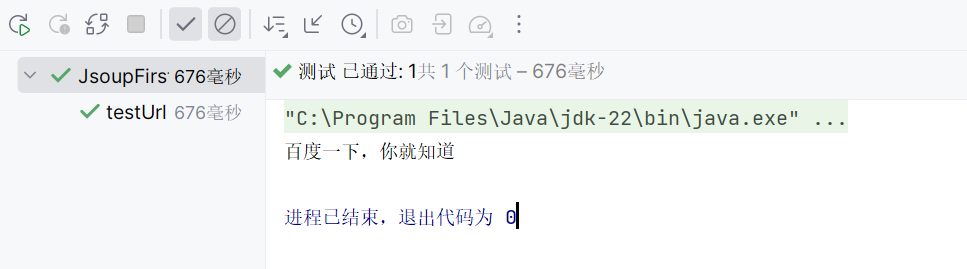

# Jsoup介绍

**Jsoup 是一个 Java 库，旨在简化对现实世界中的 HTML 和 XML 数据的处理工作。它提供了一个易于使用的 API，可以用于从 URL 中提取数据、解析数据、提取信息以及使用 DOM API 方法、CSS 和 XPath 选择器进行数据操作。**


### 简单入门程序

```java
public class JsoupFirstTest {

    @Test  // 这个注解来自 JUnit 5
    public void testUrl() throws Exception {
        Document document = Jsoup.parse(new URL("https://www.baidu.com"), 1000);
        Element title = document.getElementsByTag("title").first();
        System.out.println(title.text());
    }
}
```


测试结果:
